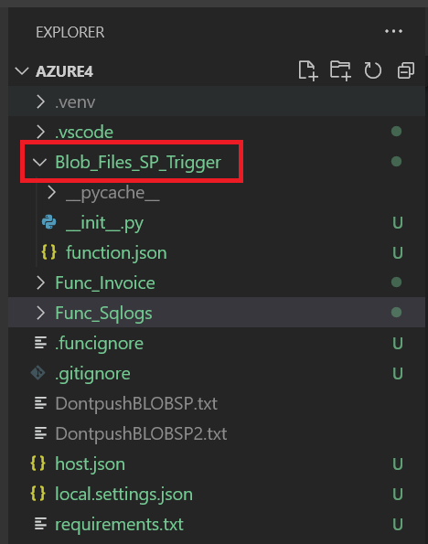
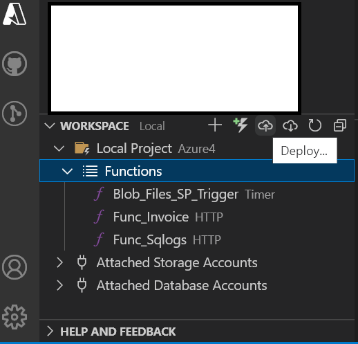
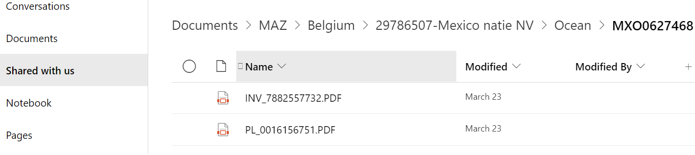

# Azure Functions Blob Sharepoint Automation
 
## Automation Task Summary

Azure Function Automation TimerTrigger has been developed to get the PDF files from blob container and store it to correct sharepoint location. The Detailed steps of the process flow has been discussed below
- Setup the connection to Blob storage & SQL Database
- Loop through all the blobs & get the list of blos available on the container
- If the Blobs available with .PDF file extension proceed with the other steps or else abort the process
- Finally, fetch the folder paths from SQL databse for the corresponding blob files where we need to save the file on the respective sharepoint directory

## Setup

After installing Azure Function tools on VSCode, your folder structure looks like below



## Procedure

1. All third party python libraries can be defined in `requirement.txt` file to include into your environment. 

```txt
azure-functions
pandas
pyodbc
fast_to_sql
azure-storage-blob
Office365-REST-Python-Client
```

| Packages                     | official Documentation                                 |
|------------------------------|--------------------------------------------------------|
| azure-functions              | https://pypi.org/project/azure-functions/              |
| pandas                       | https://pypi.org/project/pandas/                       |
| pyodbc                       | https://pypi.org/project/pyodbc/                       |
| fast_to_sql                  | https://pypi.org/project/fast-to-sql/                  |
| azure-storage-blob           | https://pypi.org/project/azure-storage-blob/           |
| office365-REST-Python-Client | https://pypi.org/project/Office365-REST-Python-Client/ |

  After defining those packages you can import in your python code.
  
  ```python
  import datetime
  import logging
  import azure.functions as func
  import pandas as pd
  import os
  import pyodbc
  #DATETIME LIBRARIES
  from datetime import date
  #BLOB LIBRARIES
  from azure.storage.blob import BlobServiceClient, BlobClient
  from azure.storage.blob import ContentSettings, ContainerClient
  #SHAREPOINT LIBRARIES
  from office365.sharepoint.client_context import ClientContext
  from office365.runtime.auth.user_credential import UserCredential
  import warnings
  warnings.filterwarnings("ignore", category=DeprecationWarning)
  warnings.filterwarnings("ignore", category=UserWarning)  
  ```

  Here is the main function of our Python code. **Please replace with your own credentials for SQL DB/BLOB/Sharepoint**
  
  ```python
  def main(mytimer: func.TimerRequest) -> None:
  utc_timestamp = datetime.datetime.utcnow().replace(
      tzinfo=datetime.timezone.utc).isoformat()

  if mytimer.past_due:
      logging.info('The timer is past due!')

  # Set up the connection to the blob storage
  # Connection string to BLOB storage
  MY_CONNECTION_STRING = '(YOUR BLOB STRING connection)'
  # Replace with blob container name
  MY_BLOB_CONTAINER = '(YOUR BLOB CONTAINER)'
  blob_service_client = BlobServiceClient.from_connection_string(MY_CONNECTION_STRING)
  container_client = blob_service_client.get_container_client(MY_BLOB_CONTAINER)
  #Connection to DB
  fileSOconn = pyodbc.connect('Driver={ODBC Driver 17 for SQL Server};'
                      'Server=(YOUR SQL SERVER);'
                      'Database=(YOUR SQL DATABASE);'
                      'UID=(YOUR SQL USERID);'
                      'PWD=(YOUR SQL PASSWORD);')
  print('Get the SO for Blob files Connnected!!!')

  try:
      for blob in container_client.list_blobs():
          if blob.name.endswith('.PDF'):
              HVfile = blob.name
              fileSO = pd.read_sql_query('''
                     SELECT H.file_name,V.folder_path
                      FROM [dbo].[TABLE_1] as H
                      LEFT JOIN [dbo].[TABLE_2] as V ON H.Sales_Document = V.sales_order_number
                      WHERE H.file_name = ''' + "'" + HVfile + "'" ,fileSOconn)
              HVfileshare = pd.DataFrame(fileSO)
              HVfilekey = HVfileshare['folder_path'].unique()
              print(HVfilekey)
              if (HVfilekey != ''):
                  for i in HVfilekey:
                      blob_client = container_client.get_blob_client(HVfile)
                      Bytes_Data = blob_client.download_blob().readall()
                      ctx = ClientContext('https://(YOUR SHAREPOINT LINK)/sites/(YOUR SHAREPOINT SITE/').with_credentials(UserCredential("(YOUR SHAREPOINT                                            USERID)", "(YOUR SHAREPOINT PASSWORD)"))    
                      list_title = "Shared%20Documents"
                      ##### UPLOADING DIRECTLY ON THE SHAREPOINT FOLDER ####
                      HVpath = list_title + "/" + i
                      target_folder = ctx.web.ensure_folder_path(HVpath).execute_query()
                      name = os.path.basename(blob.name)
                      target_file = target_folder.upload_file(name, Bytes_Data).execute_query()      
                      print("File has been uploaded to url: {0}".format(target_file.serverRelativeUrl))
                      DEL_container_client = ContainerClient.from_connection_string(conn_str=MY_CONNECTION_STRING, container_name=MY_BLOB_CONTAINER)
                      DEL_container_client.delete_blob(blob=HVfile)
                      print("File: " + HVfile + " " + "removed successfully from BLOB storage!!")
          else:
              print("For this File: " + HVfile + " " + "Folder path not available in DB")
  except Exception as e:
      print("Error has occurred : ", str(e))

  logging.info('Python timer trigger function ran at %s', utc_timestamp)
    
  ```

2. After you test your function select "Deploy to Function App" to publish your local Azure funtion app to Azure Functions App.



3. Finally, the azure timertrigger function app run for every 1 hour [**Cron Generator**](https://crontab.guru/#*_*_*_*) and automatically save pdf file from blob container to the destination sharepoint folder.

**Output**



## Materials

* [Taking a closer look at Python support for Azure Functions](https://azure.microsoft.com/en-us/blog/taking-a-closer-look-at-python-support-for-azure-functions)
* More details about [Azure Functions for Visual Studio Code (Preview)
](https://github.com/Microsoft/vscode-azurefunctions)
* More details about [Create your first Python function in Azure (Preview)
](https://docs.microsoft.com/en-us/azure/azure-functions/functions-create-first-function-python)
* More details about [Timer trigger for Azure Functions using python (Preview)
](https://learn.microsoft.com/en-us/azure/azure-functions/functions-bindings-timer)
* [Cron generator for timertrigger](https://crontab.guru/#*_*_*_*)

Thanks!!